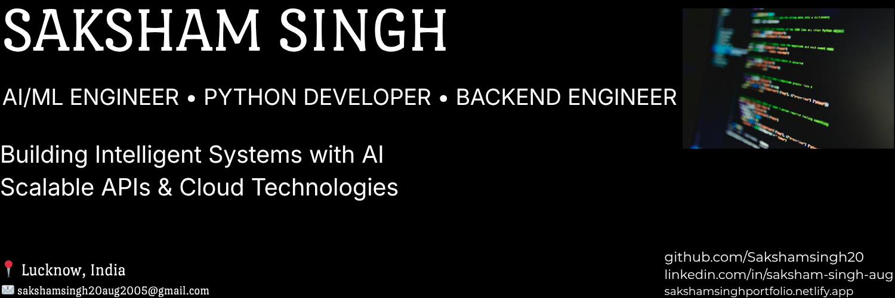

  

<h1 align="center">Hi 👋, I'm Saksham Singh</h1>

<h3 align="center">
🤖 AI/ML Engineer • ⚙️ Backend Developer • 🐍 Python Engineer
</h3>

  
  
  

  

---

## 🚀 About Me

🎓 B.Tech CSE (AI & ML) Student at VIT Bhopal

🤖 Passionate about Artificial Intelligence, Machine Learning, NLP & LLM Applications

⚙️ Backend-focused developer building scalable APIs and cloud-native systems

☁️ Hands-on experience with Docker, AWS, OCI and deployment workflows

📈 Continuously learning System Design, Generative AI and Distributed Systems

💡 Goal: Build impactful AI-powered products used by millions

📫 Email: **[sakshamsingh20aug2005@gmail.com](mailto:sakshamsingh20aug2005@gmail.com)**

---

## 🛠 Tech Stack

---

## 📊 GitHub Statistics

---

## 📈 GitHub Activity Graph

---

## 🏆 GitHub Trophies

---

## 💼 Featured Projects

### 🧠 HireSense – AI Resume Analyzer

* ATS-compliant resume analysis platform
* NLP-powered resume parsing
* Semantic job matching
* Flask backend architecture

**Tech:** Python • Flask • NLP • SpaCy

---

### 💬 Emotional Intelligence Chatbot

* Emotion-aware conversational assistant
* Retrieval-Augmented Generation (RAG)
* Sentiment classification
* Real-time interaction

**Tech:** Python • NLP • RAG • Scikit-Learn

---

### 🚆 TrackMyTrain.live

* Live train tracking platform
* PNR status monitoring
* Food ordering integration
* Optimized mobile experience

**Tech:** Python • Flask • APIs

---

## 📚 Certifications

🏅 Oracle Cloud Infrastructure AI Foundations Associate

🏅 AWS Technical Essentials

🏅 Google IT Support Professional Certificate

🏅 Applied Machine Learning in Python

---

## 🎯 Current Focus

* Machine Learning & Deep Learning
* Generative AI & LLM Applications
* Backend Engineering
* System Design
* Cloud Computing
* Open Source Contributions

---

## 🌐 Connect With Me

---

## 👀 Profile Views

---

## 💡 Developer Mindset

> "Keep building. Every project teaches something that no course can."

---

⭐ If you like my work, feel free to star my repositories and connect with me.
